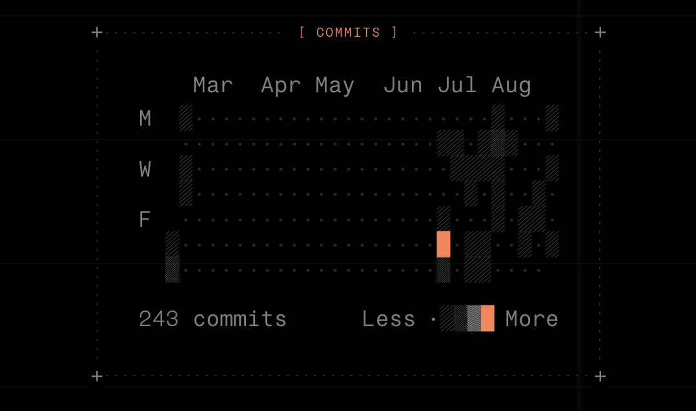
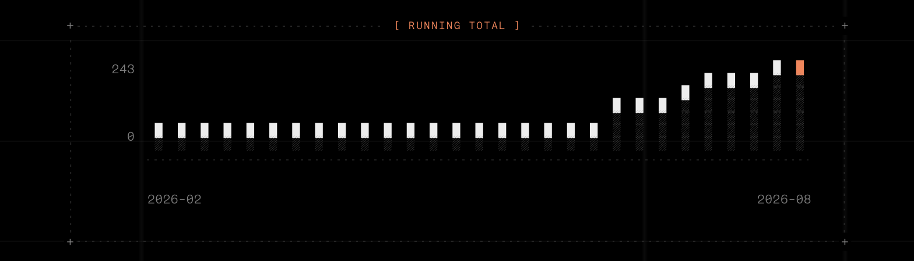

# buena-graphs

Text-first graphs on the Buena Mono grid: thirty React components,
each with an official plain-text twin — the same characters read in a
terminal, on GitHub, in chat, and render natively in
[mrkdwn](https://mrkdwn.buenalabs.io).

A buena-graphs figure is readable with no framework at all — and
renderers that know [the contract](CONTRACT.md) upgrade it.



Every graph is characters on the grid — no canvas, no SVG, no client
runtime. This is the `Activity` component as the specimen site renders
it; its plain-text twin is the same figure with the color removed:

```text
[ STATUS ]

████████████████▒████████·▒███
█████████▒██
90%               6w ago today
█ up  ▒ slow  · down
90 percent uptime over 42 days, 6w ago to today
```



**Status: private until launch.** The components and the text engine
were extracted from the buena-mono specimen site, which remains the
catalog's publishing surface at
<https://buena-mono.buenalabs.io/graphs.md>. Browse every component
rendered live at <https://buena-mono.buenalabs.io/graphs>.

## Install

Components, into any shadcn-style project (each item carries its
dependencies, theme variables, and css utilities):

```sh
npx shadcn@latest add https://raw.githubusercontent.com/buenagames/buena-graphs/main/r/graph-uptime.json
```

The agent skill, which teaches a coding agent when to copy a text
twin and when to install a component:

```sh
npx skills add buenagames/buena-graphs
```

## What ships from this repo

| Artifact | What it is |
|---|---|
| [`CONTRACT.md`](CONTRACT.md) | The frame contract — the text grammar a renderer may rely on, semver'd |
| [`src/`](src/) | Components + the DOM-to-text engine |
| [`r/`](r/) | shadcn-compatible registry, generated — never hand-edit |
| [`skills/buena-graphs/`](skills/buena-graphs/) | The agent skill, with the bundled catalog and a gold-standard [example](skills/buena-graphs/examples/sample-report.md) |

## The thirty components

Generated from the catalog metadata — regenerate with
`node scripts/gen-readme-components.mjs`, never hand-edit the table.

<!-- components:start -->
| Registry name | Component | What it draws |
|---|---|---|
| `graph-activity` | Activity | A contribution grid. Dated counts in, weeks and intensity derived. |
| `graph-bars` | Bars | Two series above and below a label — a before and after of the same categories, with the thing between them named. |
| `graph-bullet` | Bullet | Value against target on one track, for a number with something to beat. |
| `graph-calendar` | Calendar | One month on a seven-column grid, with days marked and one picked out. |
| `graph-cells` | Cells | Small multiples of an on-and-off grid — the same shape drawn once per group, for comparing patterns rather than magnitudes. |
| `graph-compare` | Compare | A feature matrix. Booleans draw as ✓ and –; one column takes the accent. |
| `graph-countdown` | Countdown | Time remaining until an instant, with a message for when it lands. |
| `graph-diff` | Diff | Added, removed and unchanged rows, with a total at the bottom. |
| `graph-flow` | Flow | Nodes on dashed arrows. Rows read left to right; one path can be accented. |
| `graph-frame` | Frame | Not a graph — the dashed figure the other twenty-nine are drawn inside. Compose it with GraphBody, GraphTitle, GraphRule, GraphTrack and GraphTick to draw one of your own. |
| `graph-funnel` | Funnel | Steps that only ever narrow, with the drop shown at each one. |
| `graph-gantt` | Gantt | Bars on a shared track, measured from day counts rather than drawn. |
| `graph-heatmap` | Heatmap | A punchcard: labelled rows against labelled columns, intensity by glyph. |
| `graph-invoice` | Invoice | A document rather than a chart — the frame doing receipts and statements. |
| `graph-kpi` | KPI | One number with its trend under it — a headline that shows its working. |
| `graph-meter` | Meter | A single value on a track — the smallest chart that is still a chart. |
| `graph-plot` | Plot | A line or area plot with a y-scale, for when the magnitude matters. |
| `graph-rank` | Rank | An ordered bar list — the shape you want for a top-n. |
| `graph-slope` | Slope | Two columns and the lines between them — what moved, and which way. |
| `graph-spark` | Spark | A sparkline in block glyphs, scaled to its own highest point. |
| `graph-spec` | Spec | A definition list — labels down the left, values right, one accented. |
| `graph-stack` | Stack | Parts of a whole, one row per group. The palette that earns three hues. |
| `graph-stat` | Stat | A row of headline figures, each with a label and an optional hint. |
| `graph-table` | Table | A plain table inside the frame, with per-column alignment and a footer. |
| `graph-timeline` | Timeline | Dated events down a connector, with done, current and upcoming states. |
| `graph-timer` | Timer | Elapsed time, time since, or a wall clock. |
| `graph-tree` | Tree | A hierarchy in branch glyphs, with one node carrying the accent. |
| `graph-uptime` | Uptime | A status strip — one cell a day, three states and a gap. |
| `graph-waffle` | Waffle | A percentage as a block of cells, when a bar would not show the remainder. |
| `graph-waterfall` | Waterfall | How a total was arrived at — a start, the moves, and where it landed. |
<!-- components:end -->

## Licensing — read this once

The **code** in this repository is MIT-licensed (see
[`LICENSE`](LICENSE)). The **Buena Mono typeface** is a separate work
under its own license and is not contained in, nor licensed by, this
repository. The graphs are drawn *for* the typeface's grid; they do
not include it.

The components derive from
[mdx-graphs](https://github.com/keshav-exe/markdown-graphs)
(MIT, Copyright (c) 2026 Keshav Bagaade), carried here as a documented
fork — the edits are listed at the top of
[`src/components/index.ts`](src/components/index.ts). The registry's
default theme values come from the same source
([`scripts/registry-theme.json`](scripts/registry-theme.json)).
