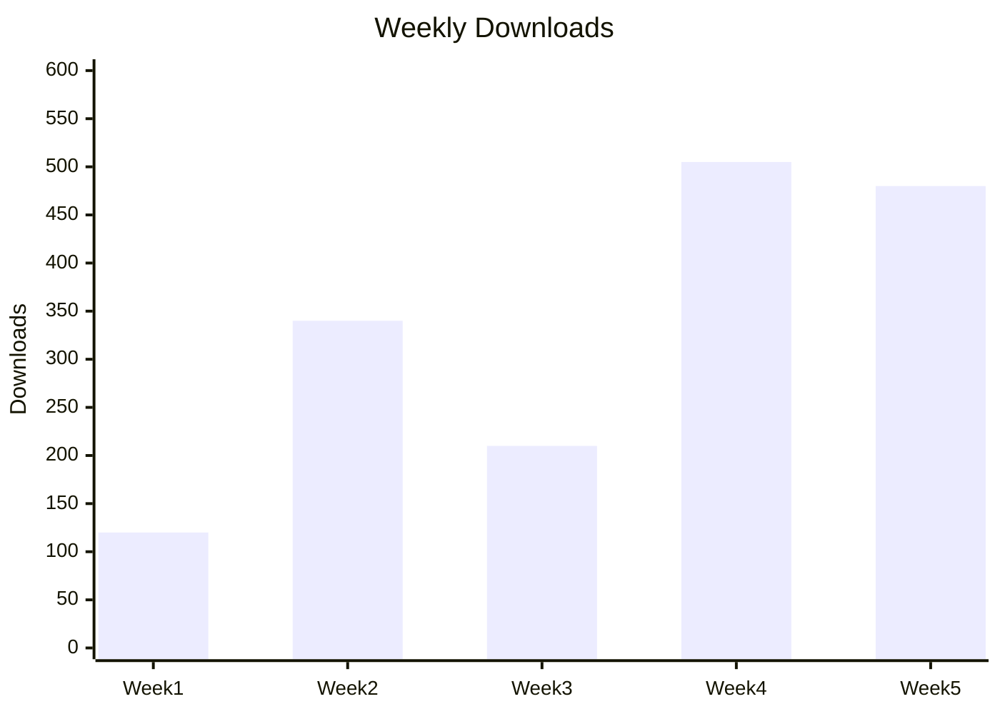

## Downloads

Weekly downloads over the last five weeks:



<details>
<summary>ASCII fallback (if Mermaid doesn't render)</summary>

```
Week 1 | ██████                 120
Week 2 | █████████████████      340
Week 3 | ███████████            210
Week 4 | █████████████████████████ 505
Week 5 | ████████████████████████  480
```

</details>

| Week | Downloads |
|------|----------:|
| 1    | 120       |
| 2    | 340       |
| 3    | 210       |
| 4    | 505       |
| 5    | 480       |
